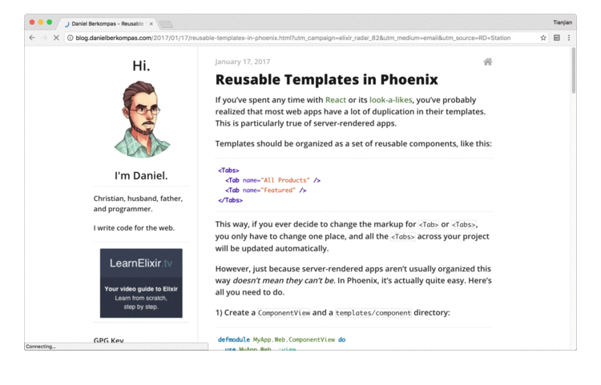

## A Chrome Extension help to read web page more easier. It looks like below:

## Features

1. Choose which part on the page to  read in clean mode.
2. Zoom in/zoom out.

## Usage

1. Click the icon to turn on CleanRead
2. Move your mouse over the part you want to read, which will display with light gray background
3. Double click

