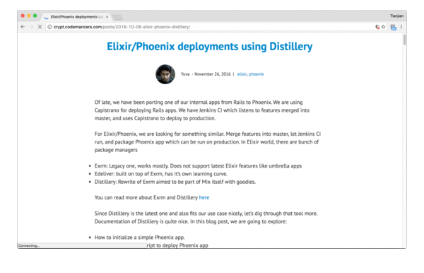

## A Chrome Extension help to read web page more easier. It looks like below:

## Features

1. Choose which part on the page to  read in clean mode.
2. Zoom in/zoom out.
3. Keyboard shortcuts support.

## Usage

1. Type `r` to turn on/off CleanRead
2. Move your mouse over the part you want to read, which will display with light gray background
3. Double click

## Keyboard shortcuts

Key | Action
--- | ---
r | Turn on/off CleanRead
Esc | Cancel clean reading
- | Zoom out
= | Zoom in

## Todo

- [x] Persist zoom percent for each domain

